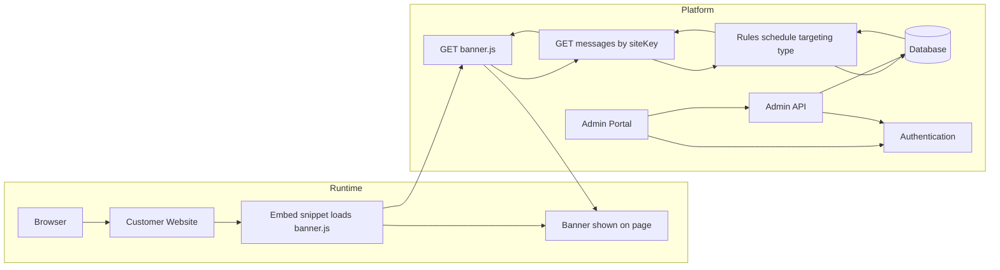

# GCBANNER Flow



Everything outside that fence is just regular Markdown text.

Here’s a clean example you can paste right under your flowchart (and it avoids using `<script>` literally, to keep
Mermaid/preview tools happy):

```md
## Notes

### Platform
- User logs in (authentication required).
- One user can manage multiple sites.
- User can CRUD banners (create, read, update, delete).
- Portal calls an Admin API that validates the user session or token.
- Messages should follow a standard type set (announcement, warning, error, info, success) and use GC Design System styles.

### Website(s)
- Website only adds one embed tag that loads the banner script (for example: a script include).
- The embed must include a site identifier (siteKey) so the platform knows which site is requesting messages.
- Security note:
  - The siteKey will be visible in the page source, so treat it like a “public identifier,” not a secret.
  - The safe approach is: the public siteKey only selects which messages to return, and the API only returns non-sensitive banner content.
  - If you want stronger protection against someone copying the siteKey, you can add domain allow-list checks:
    - Each site stores allowed domains (example.com, www.example.com).
    - When the banner script calls the API, the platform checks the request Origin or Referer header against the allow-list.
    - This is not perfect (headers can be spoofed in some cases), but it blocks most casual misuse.
  - For high-security use cases, you would need a server-side integration (site backend signs requests with a secret) or a proxy endpoint on the customer site.

  ### Tasks
- GC Notify Demo ( standards )
- Figure out how to call an API from Drupal 11
- Create Simple API ( no auth yet, just returns html, include message type at beginning)
- Talk to Team about html standards ( GC Design? )
- Create Simple portal to add messages
    - Display date/time range
    - Type of message (error, notify, warning, etc ( standards))
    - How to handle language - api call needs to include id + lang, what else?
    - KISS ( UX )!!!
- Create diagrams for demo
```